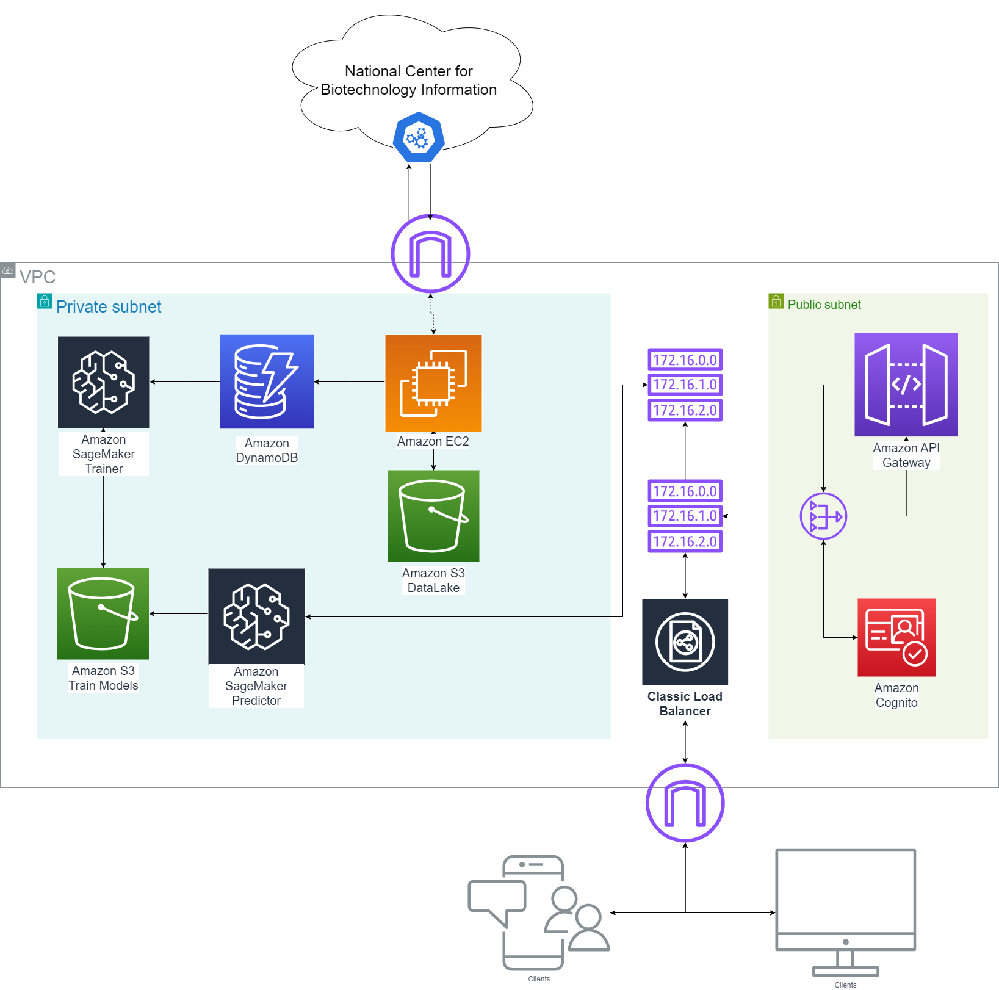

<h1 align="center">DeepAmino: Protein Classification</h1>

 
<h1 align="center">Study case 1: Proteins Classification</h1>

## 1. Description of the Process

This repository contains the code necessary to download amino acid chains from the National Center for Biotechnology Information through its Application Programming Interface (API), save them in files in a dataake and in a pandas dataframe in csv format. These are then used to try to classify the types of proteins using unsupervised learning techniques. Finally, conclusions are obtained that will be developed soon and it provides an API to be able to train the data with the hyperparameters that the user considers.

## 2. Project Structure

- **./data**: directory containing the datalake of amino acid chains used for protein classification.
- **./dataframe**: directory containing the dataframe containing the amino acid sequences.
- **./collector**: directory containing the code required to obtain the data, providing a key by using the factory method according to the user's needs, either by obtaining the data from the NCBI API or from a file folder’.
    - **collector_factory.py**: The `CollectorFactory` class selects and initialises a data collector object by applying the Factory Method design pattern.
    - **datacollector.py**: The `DataCollector` class is an abstract class that forces you to implement the collect method.
    - **api_data_collector.py**: The `ApiDataCollector` class extends `DataCollector` and is responsible for collecting the aminoacids sequences from the NCBI database.
    - **file_data_collector.py**: The `FileDataCollector` class extends `DataCollector` and is in charge of collecting data from a file.
 - **./reader**: directory containing the code required to read the DataLake.
    - **reader_factory.py**: The `ReaderFactory` class selects and initialises a data reader object by applying the Factory Method design pattern.
    - **data_reader.py**: The `DataReader` class is an abstract class that forces you to implement the read method and set the datalake path.
    - **read_datalake.py**: The `ReadDatalake` class extends `DataReader` and takes care of reading text files from a directory specified in `self.path`.
- **./writer**: directory containing the code required to write the files of the datalake.
    - **writer_factory.py**: The `WriterFactory` class selects and initialises a data writer object by applying the Factory Method design pattern.
    - **data_writer.py**: The `DataWriter` class is an abstract class that forces you to implement the write method and set the datalake path.
    - **file_writer.py**: The `FileWriter` class extends `DataWriter` and takes care of writing text files from a directory specified in `self.path`.
 - **./encoder**: directory contianing the code required to encode the aminoacid chains.
    - **encoder_factory.py**: The `EncoderFactory` class selects and initialises a data encoder object by applying the Factory Method design pattern.
    - **bow_variation.py**: The `BOWVariation` class has two methods for encoding amino acid chains which will be explained in section 3.
- **web_service.py**: provides an API using Flask that allows the classification of proteins using clustering techniques such as DBSCAN and K-Means.
- **Project.ipynb**: notebook that shows how to use the code, the API and presents the visualisation of the results.

## 3. Encoding the data

In the context of unsupervised learning, it is essential to encode the data in such a way that the models can operate efficiently with it. In this study, a variation of the Bag of Words method has been implemented, as this approach does not consider the order of amino acid chains, which is a critical factor in protein classification.

The function $\alpha(i,n)$ takes care of calculating a weight for each position $i$ in an amino acid sequence of length $n$, assigning a higher value to amino acids appearing at the beginning of the sequence and gradually decreasing towards the end.

The first proposed encoding consists of a vector whose length is determined by the get_vector_byMaxN method, which initialises a vector of zeros with a length equal to the total number of possible amino acids. Subsequently, each amino acid in the sequence is traversed, determining its position in the vector by means of a dictionary that associates amino acids with indices. The corresponding value in the vector is then incremented by multiplying it by the weight calculated by $\alpha$, where $N$ represents the maximum length of a chain in the datalake.

The second proposed encoding is similar to the first, with the exception that $N$ depends on the length of each amino acid chain.

Both encodings allow capturing the distribution of amino acids in the sequence, weighting the importance of their position for further analysis.

For instance:

## 4. Analysis of results

## 5.How to use the Aplication Programing Interface (API)

<h1 align="center">Study case 2: Architecture</h1>

## 1. Introduction

The human being needs proteins to survive all the time.  These are obtained from our body's DNA which goes through a process to synthesise amino acids to build the necessary proteins. As data scientist, the classification of this protein according to its amino acid chain was not known from the outset and so, in collaboration with the team of biologists from the University of Las Palmas de Gran Canaria, an application has been made that will be a language model that you give the amino acid chain and it will tell you what protein it is or even what protein it is close to.

## 2. Architecture

DeepAmino, the aforementioned model, is a PLM that is able to predict protein characteristics given its amino acid sequence. To deploy such a tool so that clients all around the world are able to make use of it, we introduce the following architecture. As can be seen in <b>Diagram 1</b>, the whole infrastructure is deployed on Amazon Web Services (AWS) to leverage the cloud's scalability, availability, and cost-effectiveness. AWS allows us to take advantage of economies of scale by paying only for the resources used (OpEx), rather than investing in upfront infrastructure (CapEx).

### Key Components:

#### **Amazon S3** 
- **Purpose:** Data Storage and Model Management  
- Amazon S3 is used to store two main types of data:
    1. **Training Data:** The large datasets of amino acid sequences and protein data needed for training the machine learning model. The **training data bucket** will store incoming data from various sources, including the National Center for Biotechnology Information (NCBI), facilitating further processing.
    2. **Model Outputs:** The trained models are stored and accessed via another S3 bucket, encouraging seamless versioning and updating. It will be useful to deploy real-time applications in which AI models are all the time training in batches. Once a model has been trained by the **SageMaker Trainer** service, it is uploaded to the bucket, creating an event which triggers the SageMaker Trainer service for the output model parameters

#### **Amazon SageMaker**
Training and Prediction. Amazon SageMaker is a **fully managed machine learning service** that allows developers and data scientists to build, train, and deploy machine learning models quickly and easily. It removes the heavy lifting associated with the infrastructure, so you can focus on developing the model. 

With SageMaker, you can:
1. **Train**: It simplifies training by providing pre-configured environments and optimized infrastructure for distributed training, which allows for efficient resource use when working with large datasets.
2. **Deploy**: Once the model is trained, SageMaker allows for seamless deployment in production, providing a scalable inference endpoint. The endpoint can handle a high volume of requests, making it ideal for real-time prediction tasks.
3. **Manage**: SageMaker provides tools to monitor model performance and automatically scale resources to handle varying workloads.

We will have two SageMaker services that accomplish the following tasks.
- **SageMaker Trainer:** Used for building, training, and fine-tuning the protein classification models. As explained in the code, and in Study Case 1, the trained model is a DBscan model that is able to cluster the proteins according to their amino acid sequence. The model is trained on the data directly obtained from ncbi API, and the output model is stored in the Amazon S3 bucket. Also, a new register is created into DynamoDB with the metadata of the model, such as the model name, the model version, the model location, and the model creation date, so that the model can be easily retrieved and deployed in the future.

- **SageMaker Predictor:** Deployed to serve inference requests once the model has been trained and validated, allowing predictions based on amino acid sequences provided by the users. The model is loaded from the Amazon S3 bucket and detected via an AWS SNS event, which triggers the SageMaker Predictor service to load the model and create an endpoint for inference requests. The endpoint is then used to predict the protein classification based on the input sequence.
    
#### **Amazon DynamoDB**
- **Purpose:** Database for protein sequences. Each protein amino acid sequence obtained from the **ncbi API** has been also saved into a DynamoDB Table, which helps the **SageMaker Trainer** service to train the model with processed data. The table is named **Protein-sequences**..

**Protein-sequences** stores the name-sequence pairs. This doesn't lead to redundancy, even though the same sequences, including some other relevant metadata, have already been loaded to the Amazon S3. The DynamoDB table is used to store the sequences in a structured way, allowing for quick lookups and responses to users' queries. The table is also used to store the results of the predictions made by the **SageMaker Predictor** service, facilitating quick lookups and responses to users' queries, apart from the mentioned utilities.

#### **Amazon EC2**
- **Purpose:** Computing Resources. EC2 instances are used to run general-purpose computation tasks, such as pre-processing the data received from the National Center for Biotechnology Information and orchestrating requests between services. The EC2 instance is also the one in charge of storing the retrieved data from the NCBI API into the **Protein-sequences** DynamoDB table and into the **Data Lake** S3 bucket.
  
#### **Amazon API Gateway**
- **Purpose:** Serve as a unified interface for clients. API Gateway works as the interface between users and the backend system. It accepts HTTP requests, authenticates them using Amazon Cognito, and routes them to the appropriate services. In this case of study, it is used to provide the results of the protein classification into a cluster of proteins, based on the amino acid sequence provided by the user.

#### **Amazon Cognito**
- **Purpose:** User Authentication. Cognito handles authentication and user management for secure access. Users are authenticated via Cognito before being allowed to interact with the system, ensuring secure access to sensitive bioinformatics data.

#### **Classic Load Balancer**
- **Purpose:** Traffic Distribution  
- The Classic Load Balancer is used to distribute incoming requests evenly across multiple EC2 instances and SageMaker endpoints, ensuring that the system remains responsive even under high load.

#### **Virtual Private Cloud (VPC)**
- **Purpose:** Network Security. A VPC is used to securely isolate the DeepAmino architecture in the cloud. Sensitive operations, such as training and storage, are housed in the **private subnet**, while public-facing services like API Gateway and Cognito are housed in the **public subnet**.
  
## 3. Workflow

The workflow of the DeepAmino architecture can be seen from two different perspectives: the training workflow and the prediction workflow.

### Training Workflow

1. **Data Collection**: The EC2 instance retrieves protein amino acid sequences from the National Center for Biotechnology Information (NCBI) API and stores them in the **Protein-sequences** DynamoDB table and the **Data Lake** S3 bucket.

2. **Model Training**: The **SageMaker Trainer** service reads the amino acid sequences from the **Protein-sequences** DynamoDB table, trains the DBscan model, and stores the output model in the **Model Outputs** S3 bucket. The metadata of the model is stored in the **Protein-sequences** DynamoDB table.

3. **Model Deployment**: The **AWS SNS** service from **Protein-sequences** table triggers the **SageMaker Predictor** service to load the trained model from the **Model Outputs** S3 bucket and create an endpoint for inference requests. The endpoint is used to predict the protein classification based on the input sequence.

### Prediction Workflow

1. **User Input**: The user provides an amino acid sequence to the **Amazon API Gateway**.

2. **Authentication**: The **Amazon Cognito** service authenticates the user before allowing them to interact with the system.

3. **Prediction**: The **Amazon API Gateway** forwards the amino acid sequence to the **SageMaker Predictor** service, which uses the trained model to predict the protein classification.

4. **Response**: The **SageMaker Predictor** service returns the predicted protein classification to the user via the **Amazon API Gateway**.

---

### Credits
This study was carried out by Ricardo Cárdenes Pérez and Susana Suárez Mendoza as part of an internship for the Bioinformatics course taught in the Data Science and Engineering degree at the University of Las Palmas de Gran Canaria.
- [Ricardo Cárdenes Pérez](https://github.com/ricardocardn)
- [Susana Suárez Mendoza](https://github.com/susanasrez)

---
